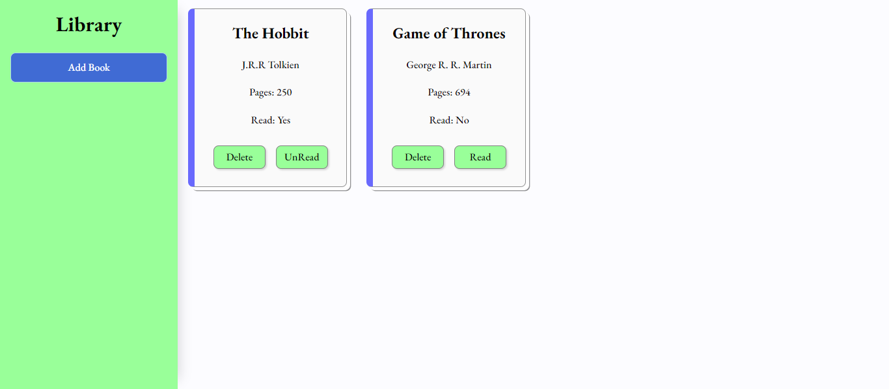

# The Odin Project - Library Project

## Objective
Project 3 in The Odin Project full JavaScript course, this is the first project in the JavaScript part of the course and  using the skills learnt about Objects, Object Constructors and Prototypes; i was able to to get some real experience and implement this into the Library project.

## model 
### index

I really enjoyed making this project, using newly learned skills alongside old skills. Being able to manipulate the DOM and show and hide the form, as well as changing the data through JavaScript, was great.

I used `grid` to get the main layout of the page as I wanted my form to show and hide on the sidebar, then giving space on the right side of the page to show the books. I also displayed `grid` to give the layout of the books as they were added by the user, and gave this `main` component `overflow` to make this side scrollable when more books are added.

Using previously learned form handling, I was able to add required fields and make sure to keep these inputs accessible with placeholders and names for screen readers. Styling the form was great fun after learning about it in previous lessons and implementing this again in the project.

Taking the user input and transferring it to an array was a little more challenging than I expected. With using the `Book` constructor, it was easy to `.push()` the `new Book` into the array and then display the books on the page by iterating over them using the `for...in` loop to add them to the main component. Here, I was able to add the books' index numbers as `data-set` attributes into the delete and read buttons, making these processes easier to handle when it came to using `splice()` to remove the correct book from the library.

When it came to toggling the read status of the book, `prototype` was the best option, giving all the books in the library the function to toggle the read status to "yes" or "no" depending on whether they have read or not read the book. Then, I was able to manipulate the button and read display to change the data on the user's page. `this` was a great help, using the scope of the function to target just the book that had been selected.

Deleting the book was very sudden, so adding a `transition` to change the opacity made the book slowly disappear from the page, and the other books took its place.

## Problems encountered
- Implementing prototype function to a object.
- Display the user's input.
- Adding fading to deleted books.
- Adding constructed objects to an array.
- Adding `data-set` to a element using JS.
- Page refreshing when form submitted.
- Deleting one object from the library array.

## New skills
- The use of `Timeout` and `transition` to fade the card when deleted.(making sure the times are the same).
- using `setAttribute` to add the books `ID` to the buttons.
- Making use of `event.preventDefault()` to stop the page refreshing when form is submitted.
- Using `.push()` and `new Book` to add the new constructed object to the array.
- Using `this` to delete the correct book.
- `for...in` loop was ideal to access each book in the library.
- Adding function to a prototype using `Book.prototype.toggleRead` to change the read status.
- On every form submit to empty the `main` component with an empty string so not to duplicate.

## languages
- HTML
- CSS
- JavaScript
